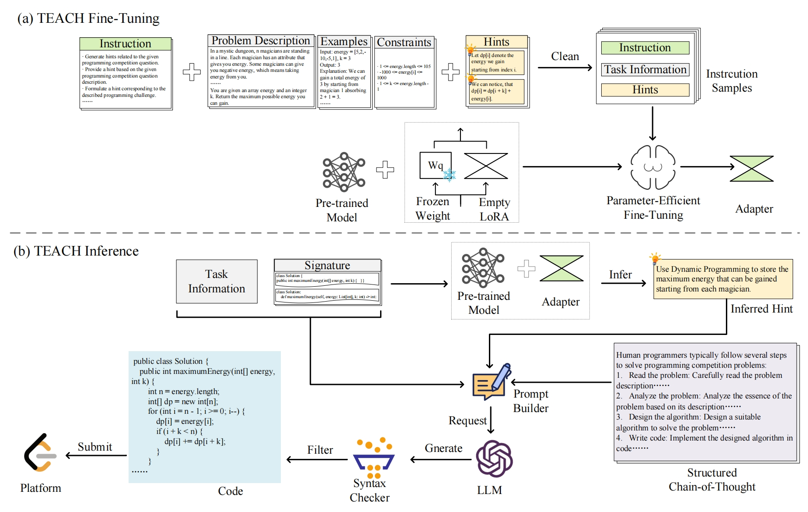

# TEACH: Tutoring LLMs in Solving Competitive Programming through Critical Hints


## Overview
TEACH, a method that tutors LLMs to solve competitive programming 
by combining critical hints with structured Chains of Thought (CoT).

# Environment Setup

- Python: Make sure you have Python installed on your system.
- Java: Install Java to enable support for Java-based packages used in this project.

### Step 1: Install Python dependencies
Create a new Python environment using conda:
```shell
conda create -n teach python=3.10
conda activate teach
```

Use pip to install the required Python packages:
```shell
pip install -r requirements.txt
```

Install the project as a package:
```shell 
pip install -e .
```

### Step 2: Install Java packages(Optional)
If you want run the expriments with Java languages, you need to download Java packages as follow.

```
animal-sniffer-annotations-1.17.jar
checker-qual-2.5.2.jar
commons-io-2.11.0.jar
commons-lang3-3.12.0.jar
error_prone_annotations-2.2.0.jar
failureaccess-1.0.1.jar
fastjson2-2.0.45.jar
fastjson-1.2.83.jar
gjf.jar
google-java-format-1.7.jar
guava-27.0.1-jre.jar
j2objc-annotations-1.1.jar
javac-shaded-9+181-r4173-1.jar
jsr305-3.0.2.jar
kotlin-stdlib-1.6.20.jar
lc-sdk-v0.0.1.jar
listenablefuture-9999.0-empty-to-avoid-conflict-with-guava.jar
okhttp-4.12.0.jar
okhttp-urlconnection-4.12.0.jar
okio-jvm-3.6.0.jar
searchableOptions.jar
```

# Generating code by TEACH


## Generate hints
All experiments were conducted on machines equipped with an Intel(R) Xeon(R) 2.10GHz CPU and a 24GB NVIDIA RTX 4090 GPU, running on the Ubuntu 20.04 platform.

You could use a server or computer with a 4090 GPU to run this inference.

1. Install the required packages:
```shell
conda activate teach
cd src/ft
pip install -r requirements.txt
```

2. Start the sever with the fine-tuned model:
```shell
cd src/ft/script
sh api.sh
```

3. Run the following command to generate hints for leetcode questions:
```shell
cd src/ft/hint/infer
python batch_gen_leetcode.py
```


## Generate code and submit to leetcode

If you want to generate code and submit to leetcode, get the leetcode account cookie and openai api key, then you can run the following command:

1. run the bash script:
```
cd src/infer/script
sh run_apps.sh
```
or
2. run the python:
```shell
python src/infer/analysis/ht_chainleetcode_submit_sh.py \
  --reuse \ 
  --cookie-user 'leetcode-cookie' \
  --qtype 'easy' \
  --difficulty 1 \
  --top-p 1.0 \
  --temperature 1.0 \
  --left 3000 \
  --right 3005 \
  --syn-type 'hint_ft_each_chain' 
  --repeat 1 \
  --time 1 \
  --lang 'java' \
  --model 'gpt-3.5-turbo-1106' \
  --dir-path 'data/leetcode/full_info/hint_3000-3235_r20/' \
  --api-key 'sk-xxx'
```
Arguments:
- `reuse`: whether to reuse the generated code
- `cookie-user`: leetcode cookie
- `qtype`: question type, [easy, medium, hard, or all]
- `difficulty`: question difficulty, a list , could be the subset of [1, 2, 3] 
- `top-p`: top-p value
- `temperature`: temperature value
- `left`: left index of the question, the minimum value is 3000
- `right`: right index of the question, the maximum value is 3235
- `syn-type`: hint type, [origin, template, hint_ft_each, hint_ft_each_chain]
- `repeat`: repeat times
- `time`: time
- `lang`: language, [python, java]
- `model`: model
- `dir-path`: directory path of the question and hints
- `api-key`: openai api key


# Fine-tuning with leetcode data

## Data Preparation
Construct the instruction data for the fine-tuning model. 
The data is stored in the `data/leetcode` directory. The data is constructed as follows:

```
python src/ft/hint/data_construct/leetcode_ft.py
```


## Fine-tuning

```shell
CUDA_VISIBLE_DEVICES=0 llamafactory-cli train examples/lora_single_gpu/llama3_lora_sft.yaml
```